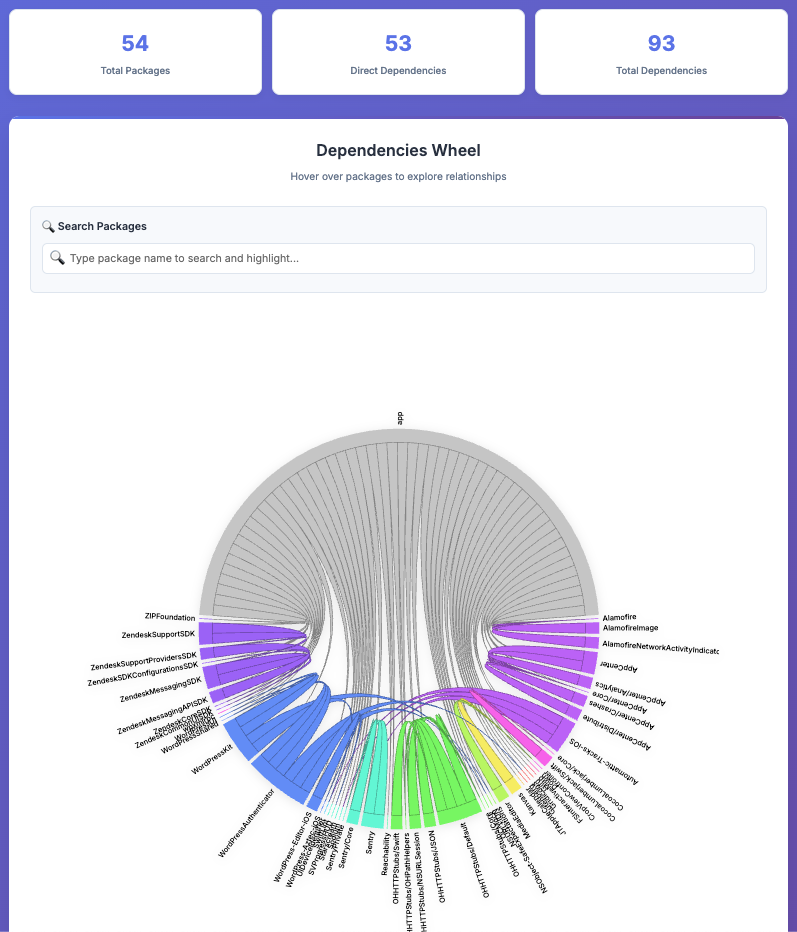

# 📦 CocoaPods Graph

[](https://badge.fury.io/rb/cocoapods-graph)
[](https://opensource.org/licenses/MIT)

Generate beautiful, interactive dependency graphs for your CocoaPods projects. Transform your `Podfile.lock` into stunning visualizations that help you understand complex pod relationships.


## ✨ Features

- **🎨 Interactive Dependency Wheel**: Beautiful D3.js visualization with hover effects and smooth animations
- **🔍 Smart Search**: Find and highlight specific packages instantly with auto-complete dropdown
- **📊 Detailed Statistics**: Real-time stats showing total packages, direct dependencies, and relationships
- **📱 Responsive Design**: Works perfectly on desktop and mobile devices
- **🎯 Modern UI/UX**: Clean, professional interface with gradient backgrounds and smooth transitions
- **⚡ Fast Performance**: Optimized for projects with hundreds of dependencies
- **🌐 Self-contained**: Generated HTML files work offline with no external dependencies

## 🚀 Installation

### Install as a Gem (Recommended)

```bash
gem install cocoapods-graph
```

### Install from Source

```bash
git clone https://github.com/erickjung/cocoapods-graph.git
cd cocoapods-graph
bundle install
gem build cocoapods-graph.gemspec
gem install cocoapods-graph-*.gem
```

## 📖 Usage

### Basic Usage

```bash
# Generate interactive HTML report
cocoapods-graph -f Podfile.lock --html

# Generate JSON data
cocoapods-graph -f Podfile.lock --json

# Print dependencies to console
cocoapods-graph -f Podfile.lock --show

# Generate both HTML and JSON
cocoapods-graph -f Podfile.lock --html --json
```

### Command Line Options

| Option | Description |
|--------|-------------|
| `-f, --file FILE` | Specify path to Podfile.lock file |
| `--html` | Generate interactive HTML dependency wheel |
| `--json` | Generate JSON data file |
| `--show` | Print dependencies to console |
| `-h, --help` | Show help message |
| `-v, --version` | Show version |

### Examples

```bash
# In your iOS project directory
cocoapods-graph -f Podfile.lock --html
# Creates: Podfile.lock.html

# Specify custom file path
cocoapods-graph -f MyProject/Podfile.lock --html --json
# Creates: MyProject/Podfile.lock.html and MyProject/Podfile.lock.json

# Quick dependency check
cocoapods-graph -f Podfile.lock --show
```

## 🎨 Features Showcase

### Interactive Dependency Wheel


*Example dependency visualization from the WordPress iOS app, showing the interactive dependency wheel with search functionality and statistics dashboard.*

📊 **[Try the live interactive demo!](docs/Wordpress-Report.html)** - Open the full WordPress iOS app dependency visualization

- **Hover effects**: Move your mouse over any package to see its relationships
- **Visual highlighting**: Related dependencies are highlighted while others fade
- **Color coding**: Each package gets a unique color for easy identification
- **Smooth animations**: Elegant transitions make exploration enjoyable

### Smart Search Functionality
- **Live search**: Results appear as you type
- **Auto-complete**: Dropdown shows matching packages with dependency counts
- **One-click selection**: Click any result to highlight it on the wheel
- **Keyboard navigation**: Use Enter/Escape for quick actions

### Professional Statistics Dashboard
- **Total Packages**: Count of all pods in your project
- **Direct Dependencies**: Number of pods your app directly depends on
- **Total Dependencies**: Sum of all dependency relationships
- **Real-time updates**: Stats update as you explore the graph

## 📁 Output Files

### HTML Report (`Podfile.lock.html`)
- Self-contained interactive visualization
- Modern, responsive design
- Search and highlight functionality
- Professional statistics dashboard
- Offline-ready (no internet required)

### JSON Data (`Podfile.lock.json`)
- Structured dependency data
- Perfect for CI/CD integration
- Easy to parse programmatically
- Compatible with other tools

## 🛠️ Development

### Setup Development Environment

```bash
git clone https://github.com/erickjung/cocoapods-graph.git
cd cocoapods-graph
bundle install
```

### Run Tests

```bash
bundle exec rake
```

### Build Gem Locally

```bash
gem build cocoapods-graph.gemspec
gem install cocoapods-graph-*.gem
```

## 🏗️ Project Structure

```
cocoapods-graph/
├── lib/
│   ├── cocoapods_graph.rb          # Main module
│   └── cocoapods_graph/
│       ├── version.rb              # Version constant
│       ├── pod_class.rb            # Pod data structure
│       ├── generator.rb            # Core parsing logic
│       └── template.html           # HTML template
├── exe/
│   └── cocoapods-graph             # Executable binary
├── cocoapods-graph.gemspec         # Gem specification
└── README.md                       # This file
```

## 🤝 Contributing

We welcome contributions! Here's how you can help:

1. **Fork the repository**
2. **Create a feature branch**: `git checkout -b my-new-feature`
3. **Make your changes** and add tests if applicable
4. **Commit your changes**: `git commit -am 'Add some feature'`
5. **Push to the branch**: `git push origin my-new-feature`
6. **Submit a pull request**

## ⭐ Support

If you find this tool helpful, please give it a star on GitHub! ⭐

Found a bug or have a feature request? [Open an issue](https://github.com/erickjung/cocoapods-graph/issues)
